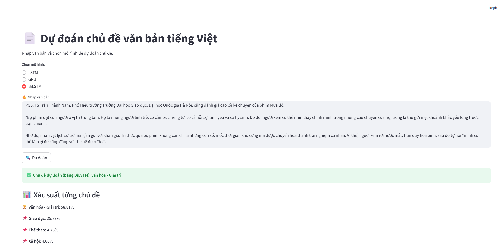

# 📰 Vietnamese News Topic Classification using NLP  

## 📌 Giới thiệu  
Dự án này áp dụng các kỹ thuật **Xử lý Ngôn ngữ Tự nhiên (NLP)** để **phân loại chủ đề tin tức tiếng Việt** dựa trên nội dung văn bản.  
Mục tiêu chính là hỗ trợ việc **tự động gán nhãn bài báo** vào các chủ đề (ví dụ: Thể thao, Chính trị, Kinh tế, Giải trí, Công nghệ...) nhằm **tăng tốc độ xử lý thông tin** và **cải thiện trải nghiệm người dùng**.  

---

## 🎯 Mục tiêu  
- Thu thập và xử lý tập dữ liệu tin tức tiếng Việt.  
- Tiền xử lý văn bản: tách từ, loại bỏ stopword, chuẩn hóa văn bản.  
- Xây dựng mô hình phân loại sử dụng các thuật toán:  
  - Deep Learning: **Bi-LSTM, LSTM, GRU)**  
- Đánh giá mô hình dựa trên các chỉ số: **Accuracy, Precision, Recall, F1-score**.  
- Xây dựng giao diện đơn giản cho phép người dùng nhập nội dung tin tức và nhận kết quả dự đoán chủ đề.  

---

## 🛠️ Công nghệ sử dụng  
- **Ngôn ngữ:** Python  
- **Xử lý ngôn ngữ:** Underthesea
- **Machine Learning:** Scikit-learn  
- **Deep Learning:** TensorFlow  
- **Giao diện demo:** Streamlit 

---

## 📂 Demo

